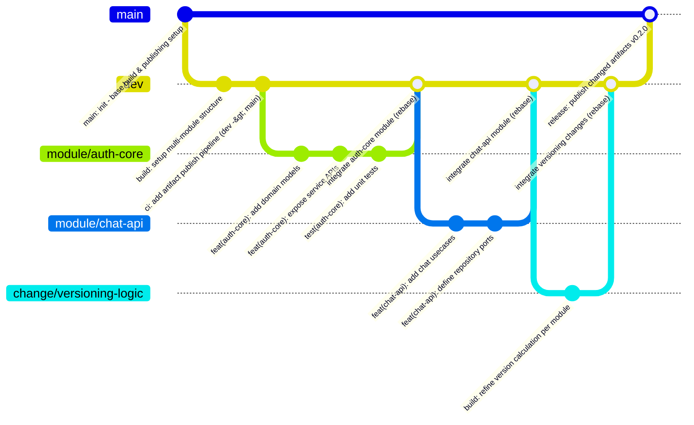

# 🔀 Merge Strategy

This repository enforces a **linear history** policy (`Merge Commit` and `Squash & Merge` are **disabled**).

# 🛠 Branch Workflows

This repository follows a **simplified GitFlow-inspired** branching model.

## 🏗 Branch Structure

`main` → Production-ready code. Only receives merges from `dev`. Triggers artifact publishing.

`dev` → Integration branch for new features and bug fixes.

## 🔄 Workflow Summary

### ✨ Feature Development

Create a branch from `dev`.
Used for new functionality.
Merge back into `dev`.

Direct merge into main is **not allowed**.

### 🚀 Promotion to Production

When `dev` is stable and validated:
Create a Pull Request from `dev` → `main`.

After approval and merge:
Artifact publishing pipeline is triggered.

### 📊 Visual

---

# 🛡 Branch Protection Rules

### 🔒 Protected

- **Applied** `main`
- **Restrict** `deletion` | `creation` | `updates`

### ⚙️ Workflows

- **Applied** `main` |`dev`
- **Restrict** `creations` | `deletions` | `force pushes`
- **Required**
    - `pull request`
        - required approvals: 1
        - dismiss stale approvals when new commits are pushed
        - conversation resolution before merging
        - allowed merge: *Rebase & Merge*
    - `status checks`
        - up to date before merging
